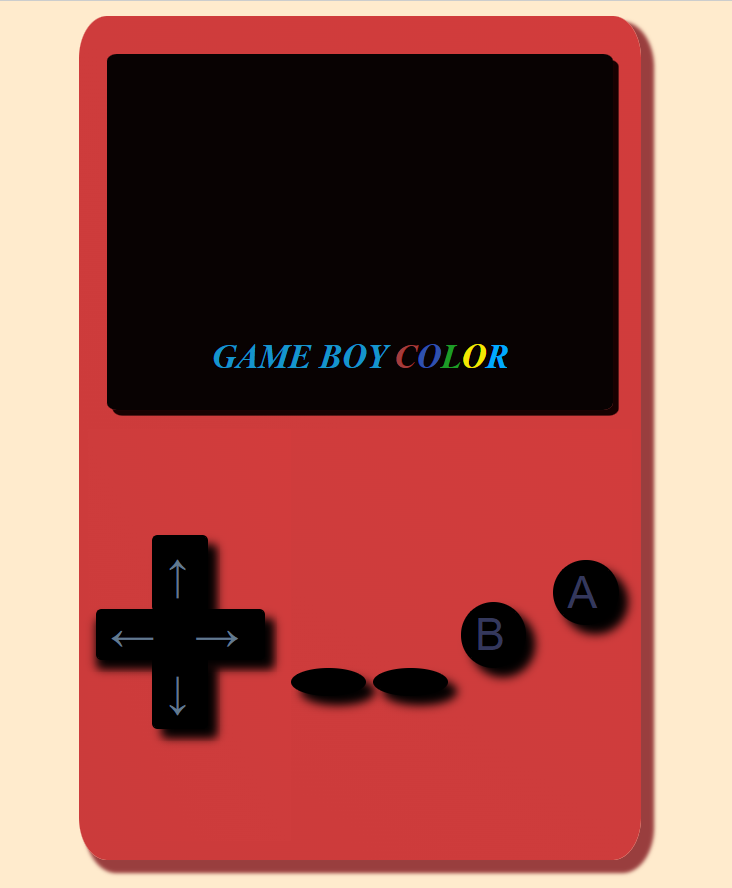

# Video consola portatil

Esta es una video consola "GAME BOY COLOR" para jugar a mas de 100 juegos.

Especificaciones técnicas. 
CPU: Sharp LR35902 @ 4.19/8.38 MHz (basado en Zilog-Z80 e Intel 8080). 
Memoria RAM: 32 KB. 
Vídeo: Controlado por la CPU. 
Pantalla: LCD Sharp en color con resolución de 160x144 pixeles
Colores: 32.768, máximo 56 en pantalla. 
Sprites simultáneos en pantalla: 40 sprites cada uno de 8x8 u 8x16 (Seleccionables). 
Sonido: Estéreo PSG de 4 canales. 2 canales de onda cuadrada, 1 canal de ruido, 1 canal de memoria de onda ("hakei memory"). 
Alimentación: 2 pilas AA, duración 10 horas. 
Dimensiones y peso: 133 mm de altura, 75 mm de ancho y 27 mm de fondo. Peso: 138 g. 
