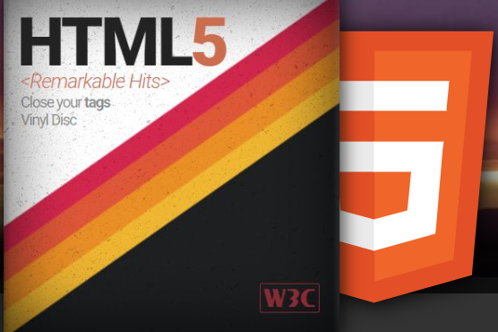
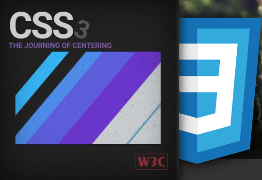

# Video consola portatil

Esta es una video consola "GAME BOY COLOR" para jugar a mas de 100 juegos.

<h2>Procedimiento</h2>

<ul>
    <li>Éste proyecto se ha creado utilzando HTML Y CSS.</li>
    <li>En cuanto el funcionamiendo es necesario utilizar una aplicación de navegación llámese (Google Chrome, Miscrosoft Edge, etc)</li>
    <li>No es necesario realizar instalaciones previas, se puede jugar 100% online</li>
</ul>

 
 
 

<h2>Stack</h2>

 
 
<h2> Deploy </h2>

 Click aquí para ver el<a href="https://franciscocampana1.github.io/consola/" target="_blank" > DEMO</a>
 
 
 

 
 

<h2>Futuras funcionalidades</h2>
<ul>
    <li>Nuevos juegos</li>
    <li>Más comandos</li>
    <li>Más velocidad en su funcionamiento</li>
</ul>

 

<h2>Contacto</h2>
